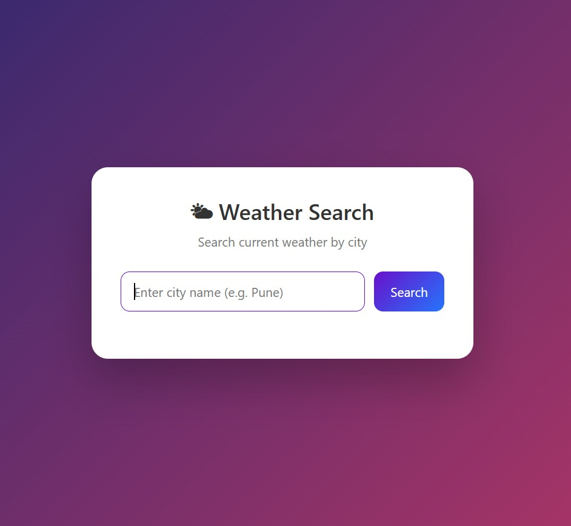
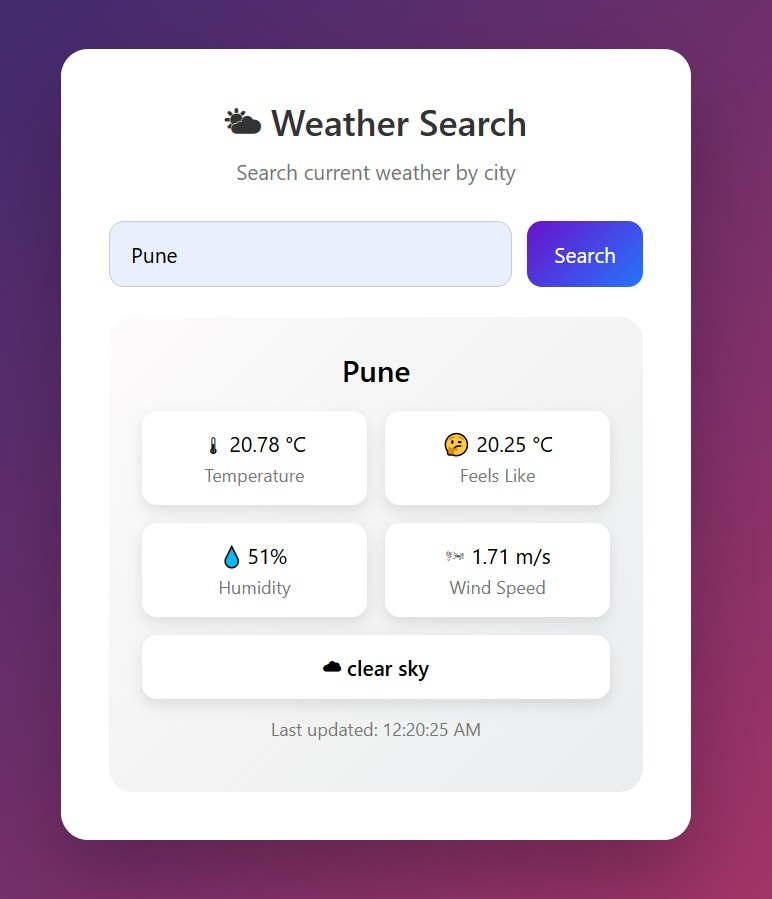

#  Weather Search Application

A full-stack Weather Search Application that allows users to fetch current weather information by city name.

This project is implemented using Core Java for the backend and HTML, CSS, and JavaScript for the frontend.  


---

##  Features

- Search current weather by city name
- Displays temperature, feels-like temperature, humidity, wind speed, and weather condition
- RESTful backend API
- In-memory caching for faster repeated requests
- Cache expiry handling
- Clean error handling with JSON responses
- Modern and user-friendly UI
- Runs completely locally

---

## 🖼 Application Screenshots

### Home Screen


### Weather Search Result



## Tech Stack

### Backend
- Java (Core Java)
- com.sun.net.httpserver.HttpServer
- Java HttpClient
- In-memory cache using ConcurrentHashMap
- org.json for JSON handling

### Frontend
- HTML
- CSS
- JavaScript (Vanilla)

### External API
- OpenWeather – Current Weather API  
  https://openweathermap.org/current

---

##  Project Architecture

```text
[ Browser (UI) ]
        |
        | fetch()
        v
[ Java REST API (HttpServer) ]
        |
        | Cached API Call
        v
[ OpenWeather API ]
```

---

## API Endpoints

### Get Weather
```
GET /api/weather?city={cityName}
```

Example:
```
http://localhost:9090/api/weather?city=Pune
```

### Health Check
```
GET /health
```

Response:
```json
{
  "status": "UP"
}
```

---

##  How to Run the Project

### Prerequisites
- Java 11 or higher
- OpenWeather API key
- VS Code (recommended)

---


##  Backend Setup

Compile the Java files:

```bash
javac -cp ".;json-20240303.jar" *.java
```

Run the server:

```bash
java -cp ".;json-20240303.jar" Main
```

Server runs at:
```
http://localhost:9090
```

---

## Frontend Setup

- Open `index.html` using VS Code Live Server  
- Or open it in a browser via a local server

---

## Caching Strategy

- In-memory cache stores API responses
- Cache expiry ensures fresh data
- Cache hit and miss are logged for performance visibility

Example logs:
```
CACHE HIT: Pune
CACHE MISS: Mumbai
```

---

##  Error Handling

The application handles:
- Invalid city names
- Invalid or missing API key
- External API failures

Example error response:
```json
{
  "error": "City not found"
}
```

---

## Security Considerations

- API keys are stored in `config.properties`
- Sensitive files are ignored using `.gitignore`
- No secrets are committed to the repository

---

## Sample Response

```json
{
  "city": "Pune",
  "temperature": 21.34,
  "feelsLike": 20.84,
  "humidity": 50,
  "windSpeed": 2.4,
  "condition": "clear sky",
  "lastUpdated": 1714661235000
}
```

---


## Conclusion

This project demonstrates strong Java fundamentals, REST API design, external API integration, caching, and performance optimization, along with a clean and user-friendly UI.
